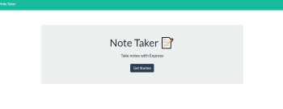
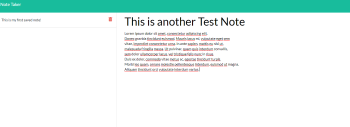

# Take A Note

- View the GitHub [repository](https://github.com/Jessica264365/Take-A-Note)
- View the live application on Heroku [here](https://glacial-ridge-69166.herokuapp.com/)

## Table of Contents

- [About the Project](https://github.com/Jessica264365/Take-A-Note#about-the-project)
  - [Usage](https://github.com/Jessica264365/Take-A-Note#usage)

* [Start Your Own](https://github.com/Jessica264365/Take-A-Note#start-your-own)
  - [Prerequisites](https://github.com/Jessica264365/Take-A-Note#prerequisites)
  - [Installation](https://github.com/Jessica264365/Take-A-Note#installation)

- [Test Instructions](https://github.com/Jessica264365/Take-A-Note#test-instructions)
- [License](https://github.com/Jessica264365/Take-A-Note#license)
- [Roadmap](https://github.com/Jessica264365/Take-A-Note#roadmap)
- [Contribute](https://github.com/Jessica264365/Take-A-Note#contribute)
- [My Contact Information](https://github.com/Jessica264365/Take-A-Note#my-contact-information)

## About the Project

This is a simple note taking application. The user has the option to create new notes and delete old notes when they are no longer needed. The notes are saved in a db.json file on the backend of the application. The notes be stored and read using the "fs" module. This application is currently deployed on Heroku.

 

### Usage

When the application is running. The user is sent to a homepage where they can click a button that will direct them a new page. On the "/notes" page the user has the option to create a note or delete one. Each note is stored on a db.json file with a unique id so that it can be retrieved by that id if it is later deleted. This application uses a "get", "post" and "delete" in it's api routes to achieve it's functionality.

## Start Your Own

To get a copy of this project on your local computer please follow these next steps.

### Prerequisites

This application is up and running on Heroku. A user will need a basic knowledge of Heroku to use it. If you want your own copy of the application you will need to know how to use Node.js, express.js and the fs module.

Clone the GitHub repository: git@github.com:Jessica264365/Take-A-Note.git

### Installation

To get started with this application fork the project for your own GitHub. Clone the repository and navigate to the folder containing the package.json. Do a npm install and install all the dependancies. Lastly run the app.js file in Node.

### Test Instructions

There are currently no test for this application.

## License

### MIT License

A short and simple permissive license with conditions only requiring preservation of copyright and license notices. Licensed works, modifications, and larger works may be distributed under different terms and without source code.

## Roadmap

This project does not currently have an open issues. Please check the [issues](https://github.com/Jessica264365/Take-A-Note/issues) page on GitHub for any updates.

## Contribute

Pull request are welcome. If you make a major change, please open and issue first to discuss what you would like to change.

## My Contact Information

Email: jwhitman135@outlook.com

GitHub Page: [Jessica264365](https://github.com/Jessica264365)
